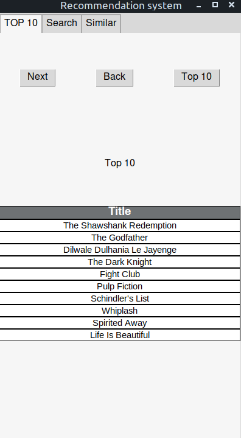
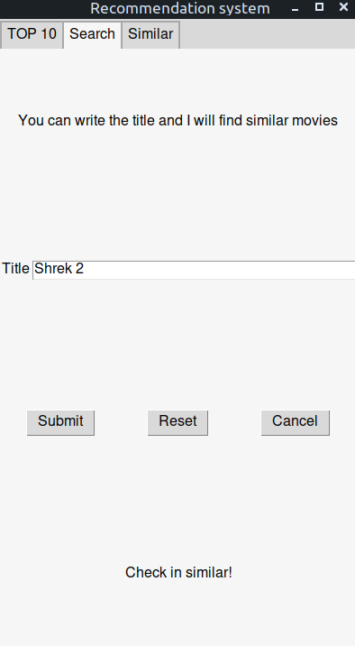
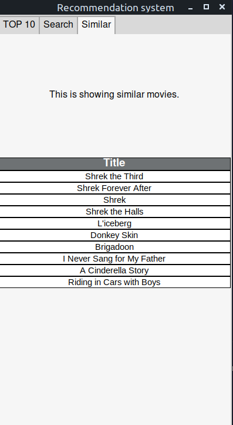

# Project-recommendation-system

This project consists of 2 basic systems. First is a base system which gives a TOP 10 movie in general ranking like Top 250 from IMDB. Second is base on plot. This gives a results (10 movies) which are similar to introduced by user.

# Data set
The source of this data is: [Kaggle](https://www.kaggle.com/rounakbanik/the-movies-dataset)

## The main movies file.
This is a file with 45 000 movies feautured in the Full MovieLens dataset. 
Features include title, budget, generes, overview, tagline, vote_avarage and vote_count

# Information about basic system
The base(file) with score and opinion has a huge disproportion. When I view max votes then the score becomes more than 4.6 points. Analogically the score is higher when number of votes is less. The best option to improve a score is create a Weighted Rating.

## Weighted Average for Individual movie's average rating

W = (Rv + Cm) / (v + m)

where: 

W - Weighted Rating 

R - the average rating of the movie

v - number of votes for the movie

m - minimum votes required to be listed in the Top. 

This is a first easy filter. I tried it for 75% or 90% which mean that I take only movies which hve more votes than at least 75%  or 90% of all movies on the list. Results is below 

C - the mean votes acreoss the whole file

Sorce which weighted rating: [Aritro Mukherjee](https://medium.com/@developeraritro/building-a-recommendation-system-using-weighted-hybrid-technique-75598b6be8ed)

# How it looks

